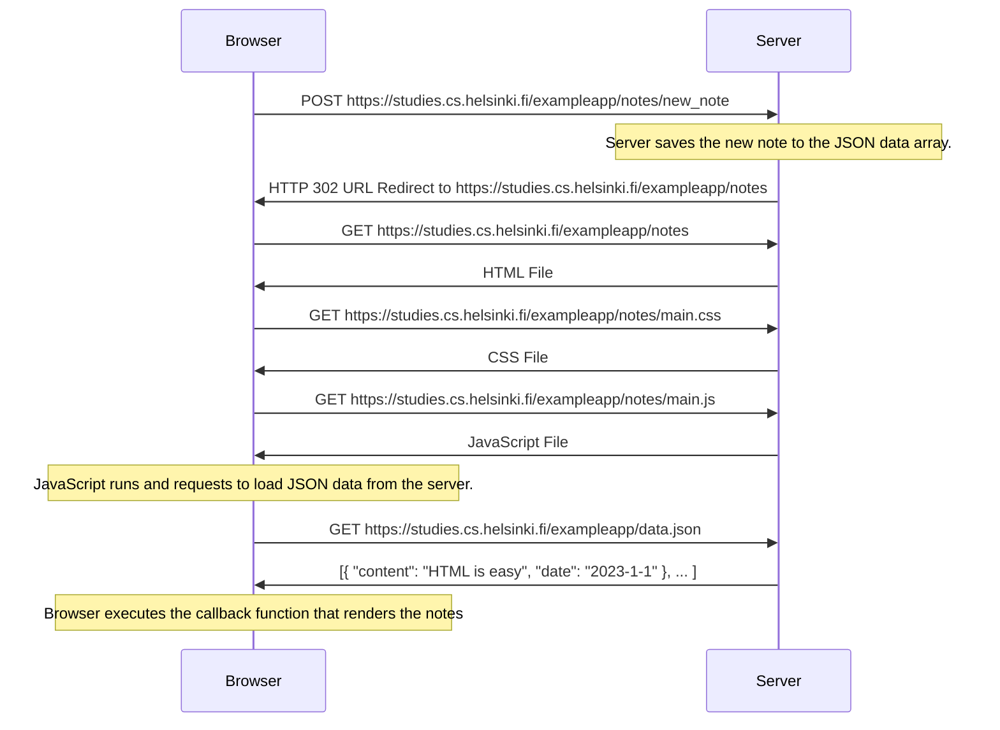

```mermaid
sequenceDiagram
    participant Browser
    participant Server

    Browser ->> Server: POST https://studies.cs.helsinki.fi/exampleapp/notes/new_note
    Note over Server: Server saves the new note to the JSON data array.
    Server ->> Browser: HTTP 302 URL Redirect to https://studies.cs.helsinki.fi/exampleapp/notes

    Browser ->> Server: GET https://studies.cs.helsinki.fi/exampleapp/notes
    Server ->> Browser: HTML File

    Browser ->> Server: GET https://studies.cs.helsinki.fi/exampleapp/notes/main.css
    Server ->> Browser: CSS File

    Browser ->> Server: GET https://studies.cs.helsinki.fi/exampleapp/notes/main.js
    Server ->> Browser: JavaScript File

    Note over Browser: JavaScript runs and requests to load JSON data from the server.

    Browser ->> Server: GET https://studies.cs.helsinki.fi/exampleapp/data.json
    Server ->> Browser: [{ "content": "HTML is easy", "date": "2023-1-1" }, ... ]

    Note over Browser: Browser executes the callback function that renders the notes
```
