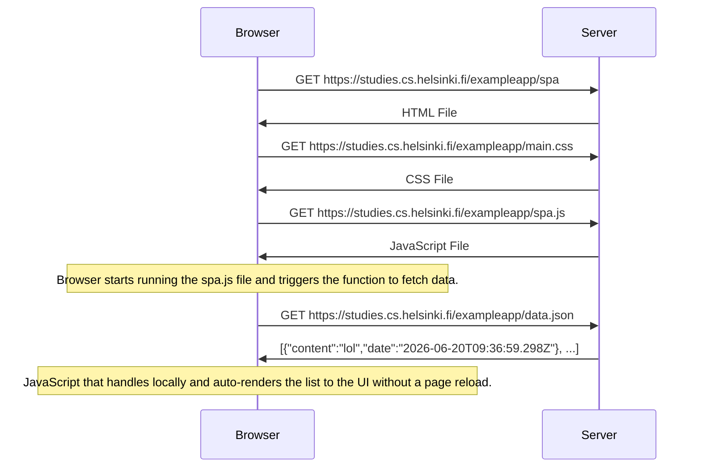

```mermaid
sequenceDiagram
    participant Browser
    participant Server

    Browser ->> Server: GET https://studies.cs.helsinki.fi/exampleapp/spa
    Server ->> Browser: HTML File

    Browser ->> Server: GET https://studies.cs.helsinki.fi/exampleapp/main.css
    Server ->> Browser: CSS File

    Browser ->> Server: GET https://studies.cs.helsinki.fi/exampleapp/spa.js
    Server ->> Browser: JavaScript File
    
    Note over Browser: Browser starts running the spa.js file and triggers the function to fetch data.

    Browser ->> Server: GET https://studies.cs.helsinki.fi/exampleapp/data.json
    Server ->> Browser: [{"content":"lol","date":"2026-06-20T09:36:59.298Z"}, ...]

    Note over Browser: JavaScript that handles locally and auto-renders the list to the UI without a page reload.
```
