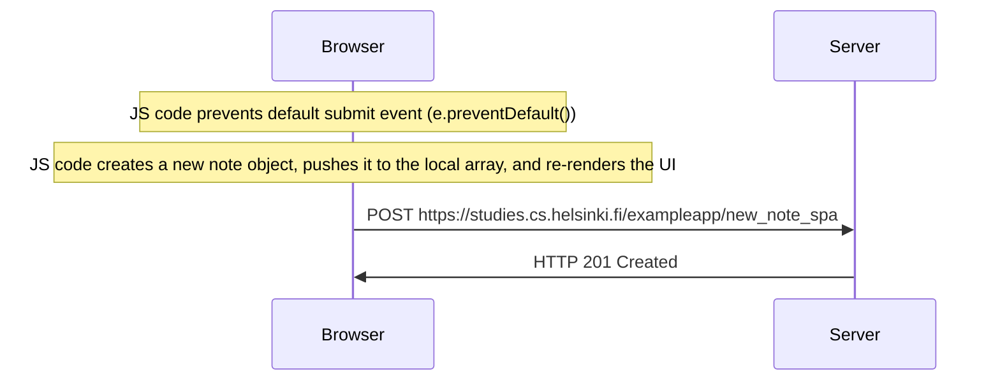

```mermaid
sequenceDiagram
    participant Browser
    participant Server

    Note over Browser: JS code prevents default submit event (e.preventDefault())
    Note over Browser: JS code creates a new note object, pushes it to the local array, and re-renders the UI

    Browser ->> Server: POST https://studies.cs.helsinki.fi/exampleapp/new_note_spa
    Server ->> Browser: HTTP 201 Created
```
